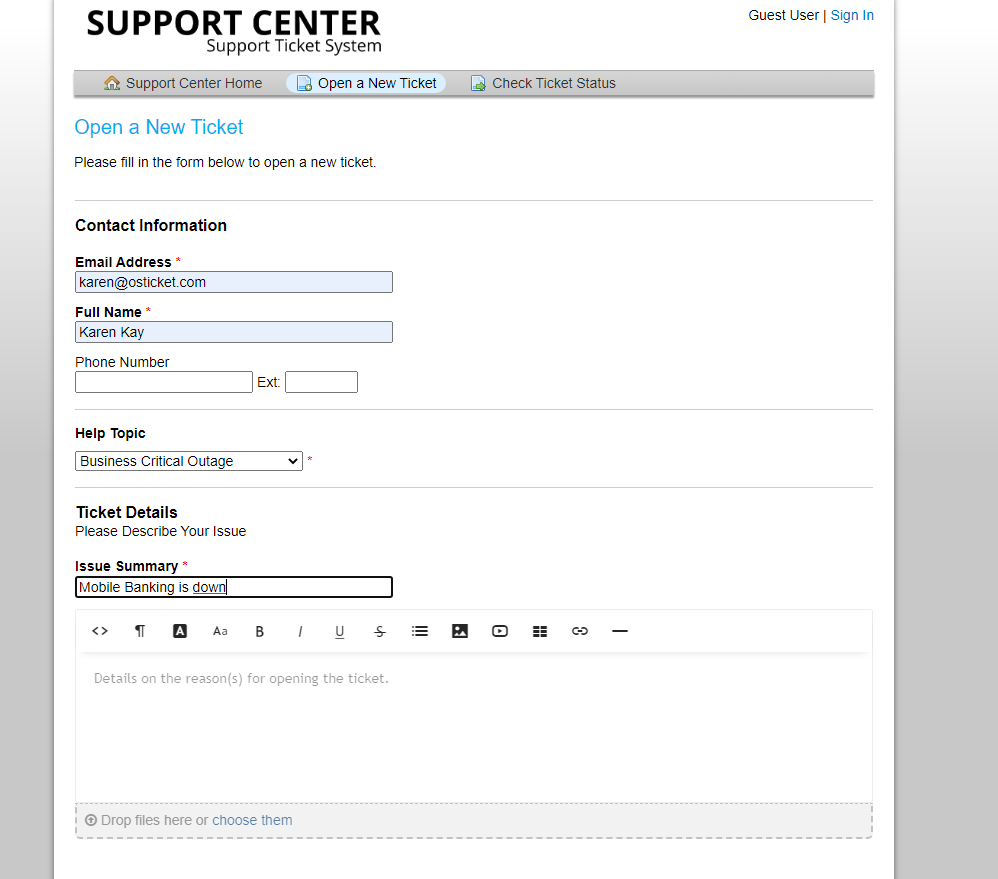
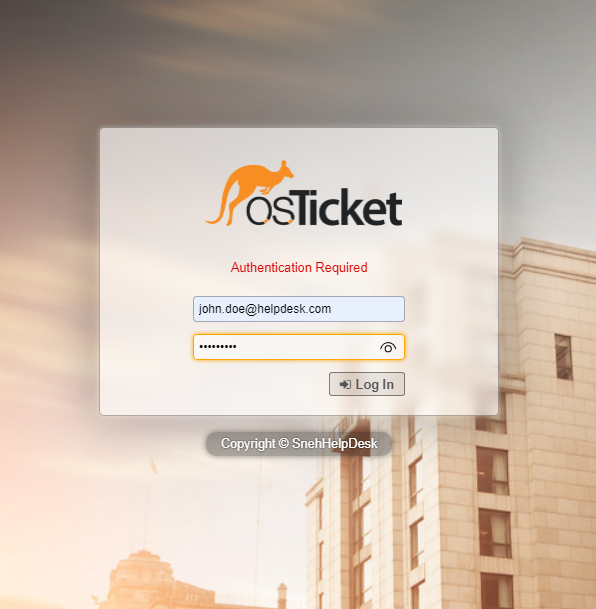
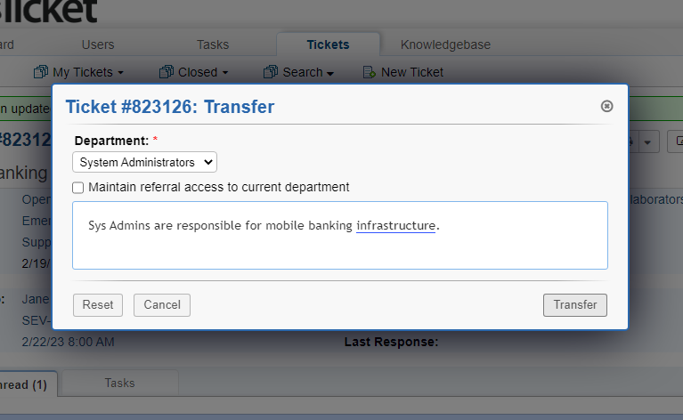
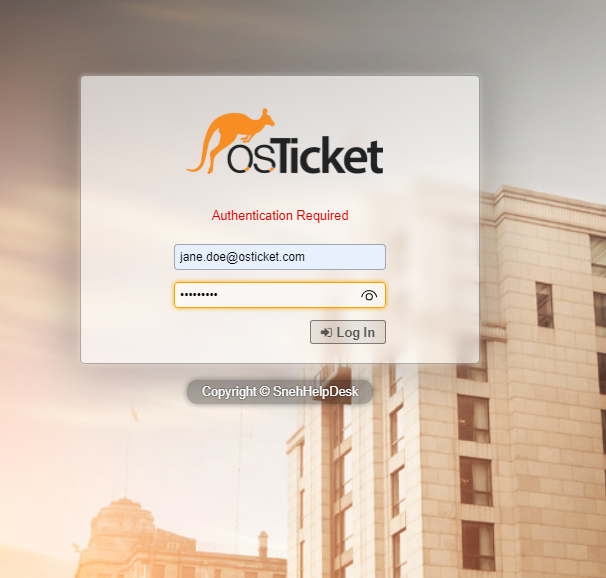
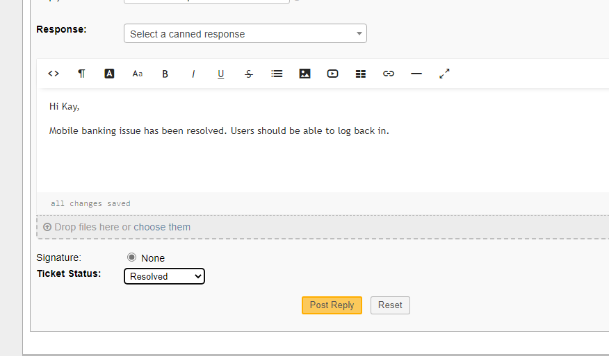

<h1>osTicket - Ticket Lifecycle: Intake Through Resolution</h1>
This tutorial outlines the lifecycle of a ticket from intake to resolution within the open-source help desk ticketing system osTicket. 

<h2>Environments and Technologies Used</h2>

- Microsoft Azure (Virtual Machines/Compute)
- Remote Desktop
- Internet Information Services (IIS)

<h2>Operating Systems Used </h2>

- Windows 10</b> (21H2)

<h2>Ticket Lifecycle Stages</h2>

- Intake
- Assignment and Communication
- Working the Issue
- Resolution

<h2>Lifecycle Stages</h2>

## Intake

User Creates a ticket:

## Assignment and Communication

Support Agent John Logs in:

Agent John sees this is Sev-A emergency ticket and has to reassign ticket to a System Administrator.

He makes sure to leave a proper message:

## Working the issue

System Administrator agent Jane Doe logs in:

Agent Jane works the issue and communicates back to agent John.

She also makes sure to switch the status of the issue from open to resolved:

## Resolution

Support agent John sees in his portal that System Administrator agent Jane has left him a message and that the ticket is now closed:>
